# python-api-challenge

This python challenge contains two jupyter notebooks WeatherPy and VacationPy. Both make calls on API databases OpenWeatherAPI and Geoapify. There are 581 cities in this list from all over the world and any data collected is stored in cities.csv. From this data we can determine if there is any corelation between the data provided from each city.

WEATHERPY

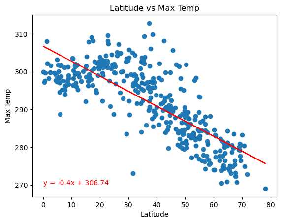

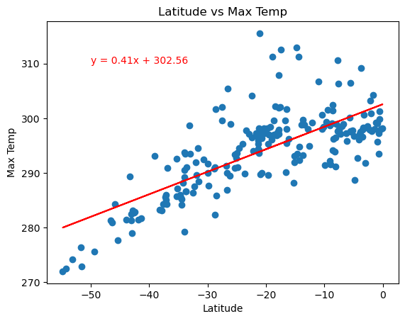

**Discussion about the linear relationship:** 
The regression for the northern hemisphere displays a negative slope showing that the max temperature decreases the further away from the equator the latitude gets. 

The regression for the southern hemisphere displays a positve slope showing that the max temperature increases the closer the latitude gets to the equator. 

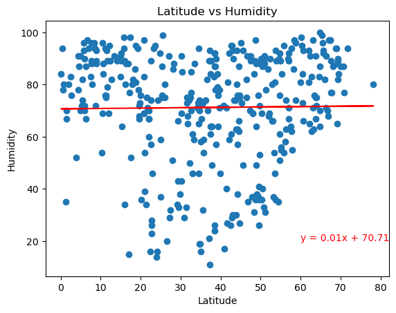

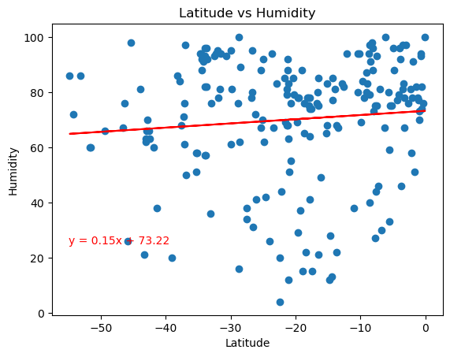

**Discussion about the linear relationship:** 
Both of the linear regressions display little to no correlation between latitude and humidity in either the northern or southern hemisphere.

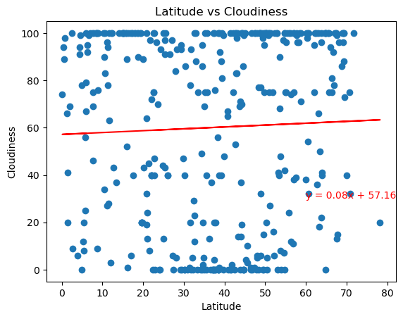

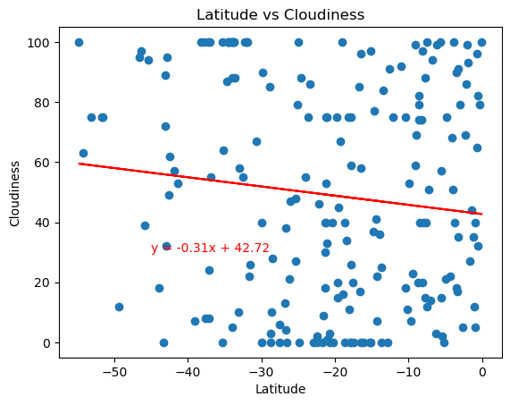

**Discussion about the linear relationship:** 
Both of the linear regressions display little to no correlation between latitude and cloudiness in either the northern or southern hemisphere.

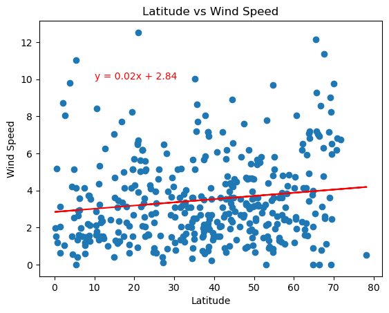

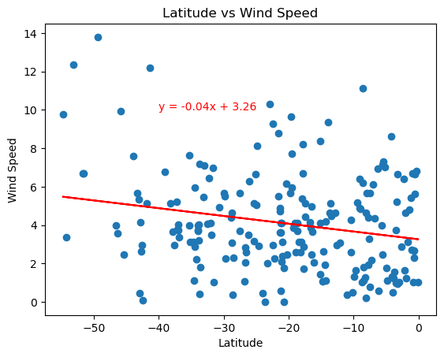

**Discussion about the linear relationship:** 
Both of the linear regressions display little to no correlation between latitude and wind speed in either the northern or southern hemisphere.

VACATIONPY

For this jupyter notebook, I used the same output.csv data to demonstrate where each of the cities collected are on a map and show based on the size of the bubble which cities have a higher or lower humidity.

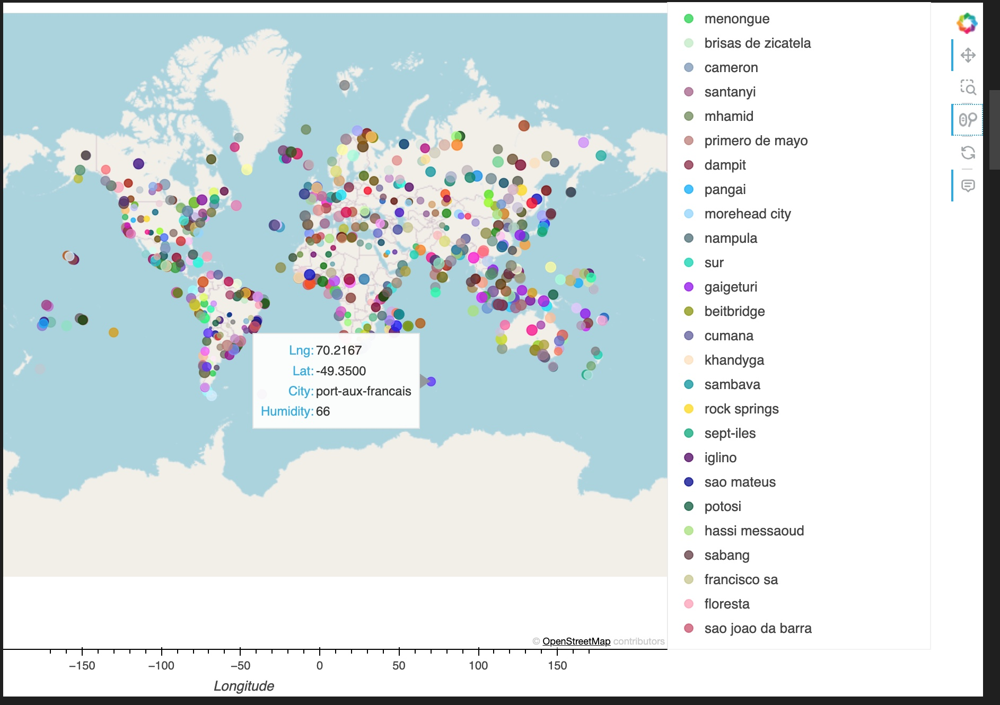

Next, I filtered the cities based on the following criterea: between 27 & 21 degrees C, wind speeds less than 4.5, and cloudiness equal to 0. Then, I added a new column to add in Hotel names in the area of the cities fitting the above criterea. 

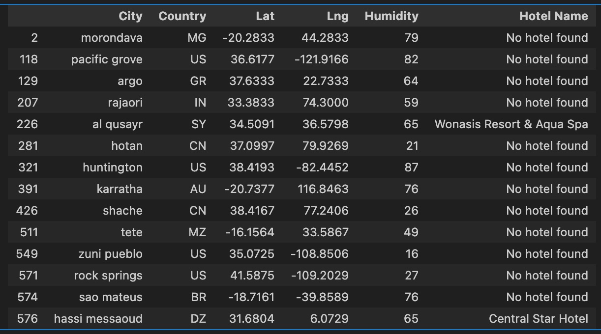

Finally, I placed all the cities that fit the criterea on a map and displayed the hotel name if there was one. 

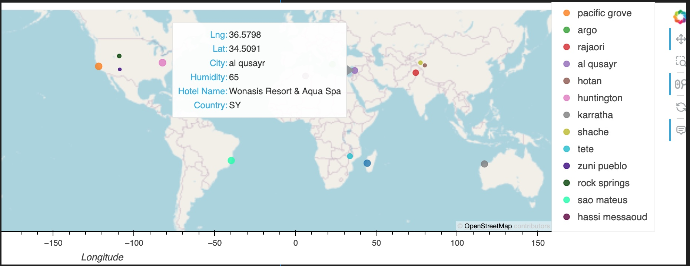